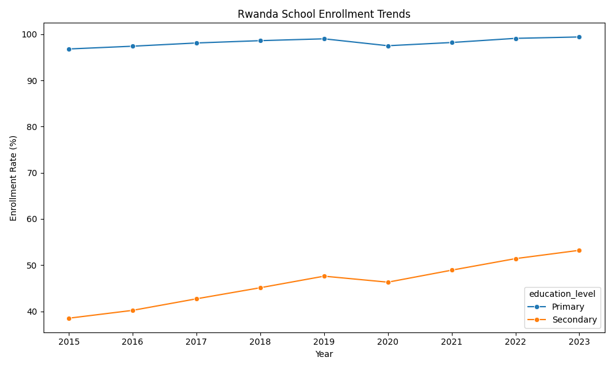
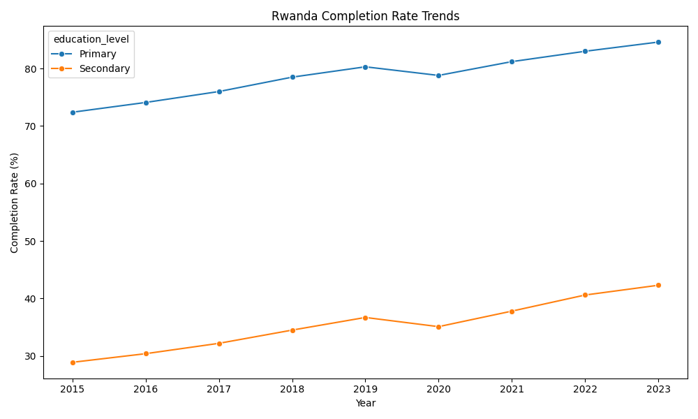
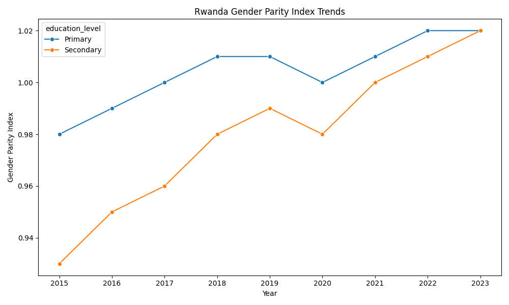
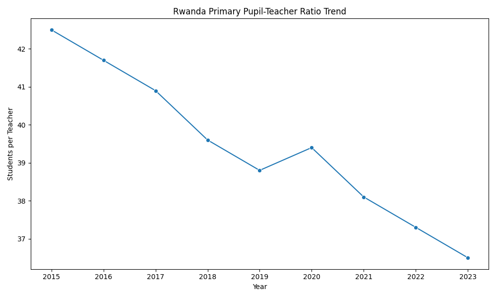
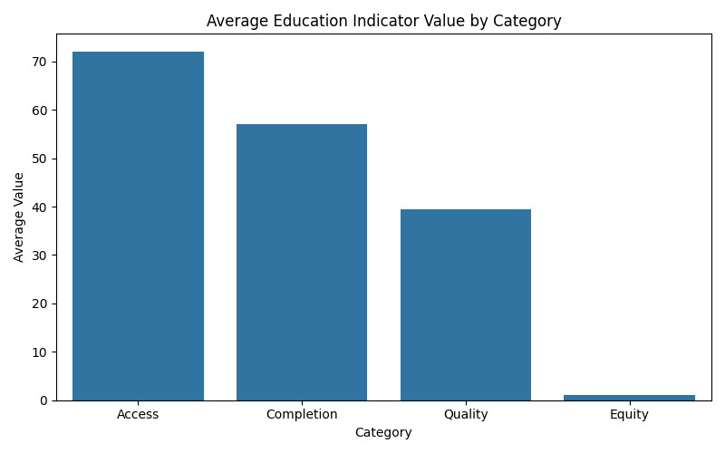

# Rwanda Education Indicators Analysis

## Project Overview

This project is a data science portfolio project analyzing Rwanda education indicators to explore trends, progress, gaps, and policy-relevant insights using Python and public development-style data.

The project focuses on education access, completion, equity, and quality indicators. It demonstrates how data analytics can support education monitoring, policy analysis, program planning, and evidence-based decision-making.

---

## Problem Statement

Education systems generate important indicator data over time, but this data must be cleaned, organized, analyzed, and visualized before it can support decision-making.

This project addresses the need for a structured analytics workflow that can:

- Organize education indicator data
- Track trends across years
- Compare primary and secondary education indicators
- Analyze access, completion, equity, and quality patterns
- Identify areas of progress and areas needing continued support
- Communicate findings through charts, reports, and dashboard planning

---

## Objectives

The main objectives of this project are to:

- Build a clean and organized education indicators dataset
- Use Python to clean, analyze, and summarize education data
- Explore trends in enrollment, completion, gender parity, and pupil-teacher ratio
- Create visualization scripts for education indicator analysis
- Develop a dashboard plan for education monitoring
- Present findings in a clear portfolio-ready format

---

## Repository Structure

- `data/rwanda_education_indicators.csv`
- `scripts/01_data_cleaning_and_eda.py`
- `scripts/02_visualizations.py`
- `reports/project_summary.md`
- `visuals/dashboard_plan.md`
- `notebooks/notebook_plan.md`
- `README.md`
- `requirements.txt`

---

## Dataset

The dataset is a sample Rwanda education indicators dataset covering 2015 to 2023. It includes indicators related to access, completion, equity, and education quality.

**Dataset file:** `data/rwanda_education_indicators.csv`

### Key Fields

- Year
- Indicator code
- Indicator name
- Education level
- Category
- Value
- Unit
- Source

### Indicator Areas

The dataset includes indicators related to:

- Primary school enrollment
- Secondary school enrollment
- Primary completion
- Secondary completion
- Primary gender parity
- Secondary gender parity
- Primary pupil-teacher ratio

---

## Tools and Technologies

- Python
- Pandas
- NumPy
- Matplotlib
- Seaborn
- Plotly
- CSV data files
- Google Looker Studio planning

---

## Analysis Workflow

### 1. Data Cleaning and Exploratory Data Analysis

The first Python script loads the dataset, checks missing values, reviews data types, checks duplicate records, summarizes indicator values, and prepares the dataset for analysis.

**Script file:** `scripts/01_data_cleaning_and_eda.py`

### 2. Visualization Script

The visualization script creates chart outputs for enrollment trends, completion trends, gender parity trends, pupil-teacher ratio trends, and average indicator values by category.

**Script file:** `scripts/02_visualizations.py`

### 3. Reporting

The project summary report explains the project purpose, background, dataset, methods, key analysis questions, expected insights, tools, skills, and next steps.

**Report file:** `reports/project_summary.md`

### 4. Dashboard Planning

The dashboard plan outlines proposed dashboard sections, KPI cards, filters, visualizations, and a future Google Looker Studio dashboard structure.

**Dashboard plan file:** `visuals/dashboard_plan.md`

### 5. Notebook Planning

The notebook plan describes a future Jupyter Notebook version of the analysis, including cleaning, exploratory analysis, trend analysis, visualization, and key findings.

**Notebook plan file:** `notebooks/notebook_plan.md`

---

## Key Analysis Questions

This project is designed to answer the following questions:

1. How have primary and secondary enrollment rates changed over time?
2. How have primary and secondary completion rates changed over time?
3. Has gender parity improved in primary and secondary education?
4. How has the primary pupil-teacher ratio changed over time?
5. Which education categories show stronger or weaker performance?
6. What trends may be useful for education planning and program monitoring?

---

## Expected Insights

This project is expected to produce insights such as:

- Primary enrollment remains high across the years.
- Secondary enrollment shows gradual improvement over time.
- Completion rates improve, but secondary completion remains lower than primary completion.
- Gender parity improves across both primary and secondary education.
- The pupil-teacher ratio declines over time, suggesting improvement in classroom staffing conditions.
- Education indicators can help identify areas where continued support may be needed.

---

## Planned Visualizations

The project is designed to support visuals such as:

- Enrollment trends over time
- Completion rate trends over time
- Gender parity index trends
- Pupil-teacher ratio trend
- Average indicator value by category
- ---

## Sample Visualizations

### Rwanda School Enrollment Trends

### Rwanda Completion Rate Trends

### Rwanda Gender Parity Index Trends

### Rwanda Primary Pupil-Teacher Ratio Trend

### Average Education Indicator Value by Category

---

## Key Findings

Based on the sample Rwanda education indicators dataset and generated visualizations, the project highlights the following findings:

1. **Primary enrollment remained consistently high.**  
   Primary school enrollment stayed close to universal access across the reporting years, showing strong education access at the primary level.

2. **Secondary enrollment improved over time.**  
   Secondary school enrollment increased gradually from 2015 to 2023, suggesting progress in expanding access beyond primary education.

3. **Completion rates improved, but secondary completion remained lower.**  
   Primary completion rates were higher than secondary completion rates throughout the period, showing that continued support may be needed to improve secondary-level completion.

4. **Gender parity improved across education levels.**  
   Both primary and secondary gender parity indicators moved closer to or above parity, suggesting progress in gender equity in education access.

5. **The primary pupil-teacher ratio improved over time.**  
   The pupil-teacher ratio declined from 2015 to 2023, suggesting improved classroom staffing conditions.

6. **Education indicators support policy and program monitoring.**  
   These findings show how education data can help identify progress, gaps, and areas where continued investment or program support may be needed.

---

## How to Use This Project

### 1. Clone the repository

`git clone https://github.com/davidniyigena/Rwanda-Education-Indicators-Analysis.git`

### 2. Install required packages

`pip install -r requirements.txt`

### 3. Run the Python data cleaning and EDA script

`python scripts/01_data_cleaning_and_eda.py`

### 4. Run the visualization script

`python scripts/02_visualizations.py`

### 5. Review the report and dashboard plan

Open:

- `reports/project_summary.md`
- `visuals/dashboard_plan.md`
- `notebooks/notebook_plan.md`

---

## Key Skills Demonstrated

- Data cleaning
- Exploratory data analysis
- Descriptive analytics
- Trend analysis
- Education indicator analysis
- Data visualization
- Public development data analysis
- Monitoring and evaluation analytics
- Policy-relevant reporting
- Dashboard planning
- Portfolio documentation

---

## Portfolio Relevance

This project connects data science with education policy, public development indicators, and monitoring and evaluation. It shows how Python and structured data analysis can support education-sector decision-making and help communicate trends clearly to stakeholders.

This project is especially relevant for roles involving data analytics, monitoring and evaluation, nonprofit program analysis, education data systems, public sector analytics, and international development.

---

## Future Improvements

Future improvements may include:

- Adding generated chart images to the `visuals/` folder
- Updating the README with sample visualizations
- Creating a full Jupyter Notebook version of the analysis
- Expanding the dataset with more indicators
- Adding real World Bank or UNESCO education data
- Comparing Rwanda with other East African countries
- Building an interactive Google Looker Studio dashboard

---

## Author

**David Niyigena**  
Data Scientist | Data Analytics | Monitoring & Evaluation Specialist  
GitHub: [github.com/davidniyigena](https://github.com/davidniyigena)
